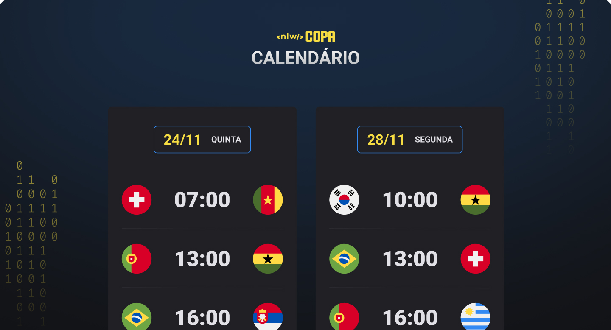

<h1 align="center">NLW #10 Copa</h1>

<a href="#-tecnologias">Tecnologias</a>&nbsp;&nbsp;&nbsp; | &nbsp;&nbsp;&nbsp;
<a href="#-projeto">Projeto</a> &nbsp;&nbsp;&nbsp; | &nbsp;&nbsp;&nbsp;
<a href="#-memo-licença">Licença</a>

 

## 🚀 Tecnologias

Esse projeto foi desenvolvido com as seguintes tecnologias:

- HTML
- CSS
- JavaScript
- Git e Github

## 💻 Projeto

O calendario da copa é um projeto que mostra os jogos da copa do mundo de 2022 e foi desenvolvido no evento NLW #10 Copa da Rocketseat.

## Licença

Esse projeto está sob a licença MIT.

## ✉️ Contato

jrtmcb@gmail.com
